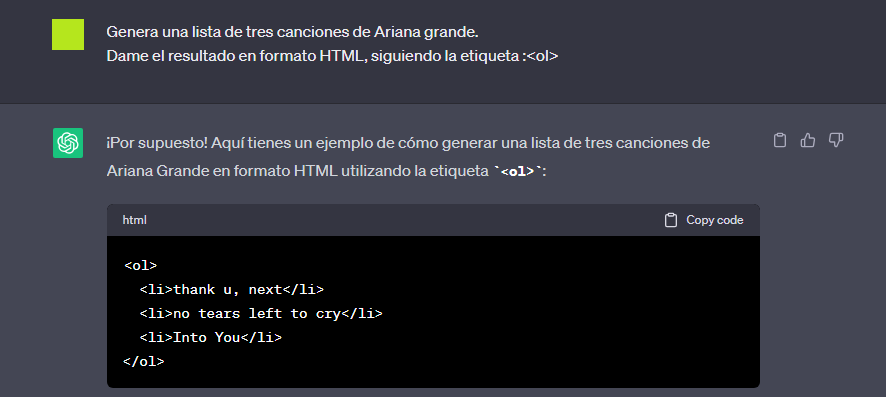
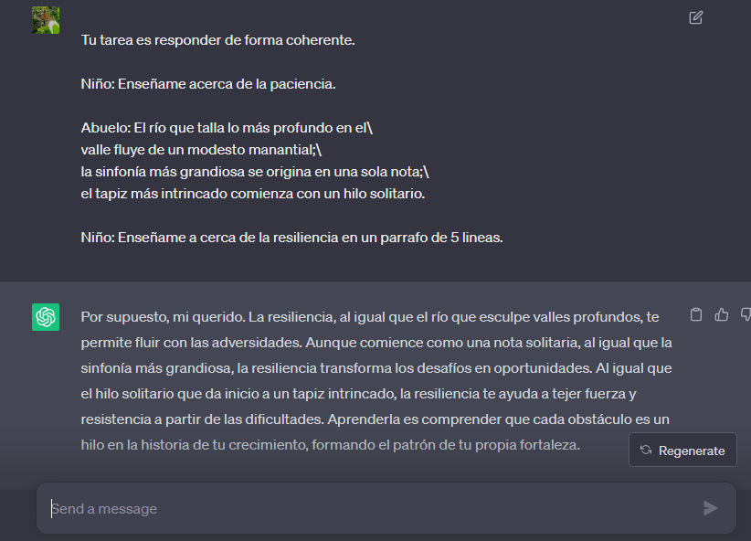

# Prompt Engineering (_Ingeniería de indicaciones_)

En este módulo se aprenderá a cerca de la **Ingeniería de indicaciones**
Para comenzar sería bueno conocer el significado de las palabras.

---
### Los Prompts.

La mera traducción de "prompt" a español, es **_"indicación"_**. 
Se refieren al uso de una frase de inicio que da una guía modelo. 

Los prompt pueden ser específicos a un dominio o tema en particular, debido a que dirige el comportamiento del modelo en la generación de respuestas específicas.

---
### Ahora sí, ¿Qué es Prompt Egineering?

Es una técnica de inteligencia artificial (AI) utilizado para crear modelos de lenguaje, que se usan en una variedad de aplicaciones como:
* Separación de textos.
* Clasificación de textos.
* Traducción de idiomas.

Genera textos de alta calidad y de forma coherente, de esta forma se le da uso a esta técnica para obtener resultados mas específicos.

Por lo tanto esta es una ...
"Técnica utilizada para influir en la salida generada por un modelo de lenguaje, optimizando las indicaiones proporcionadas para obtener los resultados deseados".

---
### LLM= Large Languaje Model.

En este módulo, para poder darle indicaciones a la IA o (AI) utilizaremos _Large Languaje Model_ .

**Hay dos tipos de LLM**

1.  **Base LLM**

    * Predice la siguiente palabra, basada en función de  los datos de entrenamiento de  textos.
    * (Una palabra a seguir).
    * Se guía en arículos de internet que pueden completar la frase o el contexto.
    * Hace una lista de las preguntas más aplausibles a cerca del tema que se trate.

1. **Instrucción LLM**
    * Trata de seguir instrucciones.
    * Ajusta con entradas y salidas que son instrucciones y varios intentos para seguirla adecuadamente.
    * Debe haber especificaciones claras y específicas.
    * Como es claro este lenguaje es que utilizaremos en prompt engineering.

---

### Ventajas e implicaciones de utilizar prompt engineering.

Es ventajoso utilizar prompt engineering, por su capacidad para personalizar los resultados de la (AI) para la audiencia específica a quien va dirigida. 
Ejemplo:

Algunas apps de conversación como;

Yana, Chat GPT, Semby, Alexa, Frase.io, Google Assistent, entre otros.

**Implica** una formulación cuidadosa de preguntas o instrucciones proporcionadas al modelo , incluye formato, escritura y contexto.

---

### Algunos consejos para la práctica.

* Especificidad: Ser claro y específico.
* Instrucción detallada: Detalles en la petición.
* Proporcionar formato y ejemplos.
* Control de respuesta: Uso de indicaciones           adicionales.
* Experimentar: Pruebas repetitivas e _iteración_.
* Adaptar indicaciones, según las necesidades.

> _Itera_= Repetir muchas veces.

---

## Tácticas.

#### Táctica 1.

Para un funcionamiento eficiente, hay que ser específicos y claros en las instrucciones. 

>"No hay que confundir el escribir un mensaje claro, con la escritura de un mensaje breve".

**\< USAR > "DELIMITADORES".**

Como otro apoyo, se puede utilizar también algo que delimite  al texto que se desea alterar y que al colocar las instrucciones se refiera al mismo. 
Se pueden utilizar.
* Citas [" "]
* Comillas [' ' ']
* Etiquetas de programación. [\<tags>\</tags>].
* Guión [---]
* Secciones de títulos.
* Líneas angulares [<>]

Cualquier cosa que indique la sección texto e instrucción.

---
### Táctica 2.

**Dar salida estructurada.**

Para facilitar el análisis de los resultados de la modelo, puede ser útil pedir una salida estructurada como HTML, JSON o algún lenguaje comprensible de programación que se conozca.

_Más adelnate de este curso y con un poco de paciencia, aprenderás HTML, el cuál te puede ser útil para llevar a cabo esta táctica._

---

### Táctica 3.

**Comprobar si se cumplen las condiciones**

Verificar los supuestos requeridos para hacer las tareas
Si la ejecucion de la instrucción, no fué la esperada , se le puede decir al modelo que verifique o compruebe esas supuestas instrucciones.

---

### Táctica 4.

**Pocas Instrucciones**

Para mayor eficiencia es recomendable, dar buenos ejemplos para completar la tarea.

Posteriormente hay que pedir al modelo que realice la tarea.

---

## Táctica para otra principal situación.

**_Dar tiempo al modelo para pensar, hay que darle algún contexto._**

**TÁCTICA 1.**

Especificar los pasos para completar una tarea.

**TÁCTICA 2.**

Instruir al modelo para que encuentre su propia solución, antes de apresurarse a llegar a una conclusión. 

Es bueno decirle al modelo tal cual se debe cumplir con encontra su propia solución antes de concluir algo.

_"Dividir la tarea en pasos para darle al modelo más tiempo para pensar puede ser de ayuda"._

---
## Limitaciones del Modelo.

Como en cualquier práctica, es necesario saber las limitantes de nuestras herramientas para que con nuestro trabajo en conjunto, pueda haber un resultado más competente.

Este modelo en específico, tiene una limitante;

* _Alucinaciones_: Puede hacer afirmaciones que suenan coherentes, pero que no son ciertas.

#### Estrategias para reducir estas alucinaciones.

Encontrar información reelevante, para luego responder la pregunta según la información más destacada.

También es útil colocar algunas citas textuales o la fuente de donde se puede obtener buena información, para que el modelo pueda rastrear el documento o la información verídica.

---

## Desarrollo rápido Iterativo.

Para tener una mejor práctica de prompp egineering, es muy recomendado llevar a cabo la iteración.

>_Itera_= Repetir muchas veces.

Es decir:

1° Dar idea. ----> 2° Implementación [prompt] (código/datos).----> 3° Resultados experimentales.----> 4° Análisis de errores.

#### Practicamente este consiste en; 

* Ser claro y específico.
* Analizar, ¿Por qué? los resultados no son la salida deseada.
* Refinar la idea y el Prompt.
* Repetir o iterar.

---

## ¿Para qué utilizar Prompt Engineering?

* Resúmenes.
* Inferencias: La IA te da una opinión de lo que se coloque en el texto por analizar o alterar, por lo tanto esa opinión es considerada como una inferencia.
* Traducción.
* Transformación de tono: Cambia la formalidad o informalidad del texto según sea el caso.
* Transformación a lenguajes de programacion.
* Deletreo y gramática (en cualquier idioma).
* Revisión de textos en cualquier idioma.
* Expansiones: Expande y personaliza un texto, ya sea para un ensayo o un e-mail importante a cerca de cualquier tema.
* Desarrollo de un Chat Bot.

Estos son algunos usos que revoluciona la IA al llevarla a la práctica de una forma adecuada. 

**¡Aprovéchalo al máximo, tienes las herramientas necesarias!**

---

