# Introducción a HTML.

## ¿Qué es HTML?

HTML es el lenguaje de marcado de hipertexto, fundamental para crear páginas web. Se trata de un conjunto de etiquetas que describen la estructura y contenido de una página. Cada etiqueta tiene un propósito, como definir encabezados, párrafos, imágenes y enlaces. 

Los navegadores web interpretan el HTML para mostrar el contenido de una manera organizada y visualmente atractiva. Es el lenguaje básico que permite dar forma a lo que vemos en Internet. A medida que aprendas más, podrás combinar HTML con otros lenguajes y herramientas para hacer sitios web interactivos y atractivos.

---
## ¿Qué son las etiquetas?

Como ya leímos en la explicación de ¿Qué es HTML?
este tipo de lenguaje, está basado en **ETIQUETAS** que describen la estructura.

Las etiquetas son el elemento fundamental de HTML.

Se componen por los siguientes caracteres:  
>**(<) menor que, (>) mayor que** y **(/) slash o diagonal**. 

La mayoría de etiquetas tienen etiqueta de inicio y etiqueta de cierre, estas se diferencian porque la etiqueta de cierre contiene el carácter **(/) slash o diagonal** antes del nombre.

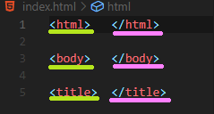

* La etiqueta subrayada de color verde; es la etiqueta de apertura.

* La etiqueta subrayada de color rosa; es la etiqueta de cierre, la cuál se identifica por el slash que tiene al inicio de la palabra.

* Si bien, las etiquetas tambien pueden no tener etiqueta de cierre como  que solo ocupa una línea.

---

## ¿Qué son los atributos?

Los atributos de HTML son palabras especiales utilizadas dentro de la etiqueta de apertura, para controlar el comportamiento del elemento

* Los atributos HTML proporcionan información adicional sobre los elementos HTML.

* Los atributos siempre se especifican en la etiqueta de inicio.
* Los atributos generalmente vienen en pares de nombre/valor como: nombre="valor".

Entre los más comunes se encuentran:

* ```id```: este es un atributo de identificación HTML que se utiliza para especificar una identificación única para un elemento en HTML.
Es importante saber que no puede haber más de un elemento con la misma identificación en un documento HTML.

* ```class```: el atributo de clase HTML se utiliza para **especificar** una clase para un elemento HTML. Este atributo, se usa a menudo para apuntar a un nombre de clase en una hoja de estilo.


---
## ¿Cómo crear un archivo HTML?

Para poder crear un archivo _.html_, primeramente debemos tener un editor de código, en este caso utilizaremos VS Code.

**_Es importante recordar cómo crear un nuevo archivo en nuestro editor de código._**

Para crear un archivo HTML hay que tener en cuenta dos cosas; 

* _La terminación del archivo:_ Es lo que ayudará a identificar qué tipo de archivo es, ya sea (.docs, .txt, .css, entre otros). En este caso nuestra principal terminación será **.html**

* _El nombre del archivo:_  Es recomendable colocar index al archivo principal de nuestro proyecto, sin embargo no hay problema en colocar un nombre distinto a los demás archivos, siempre y cuando sean fáciles de localizar para tí.

EJEMPLO VISUAL.

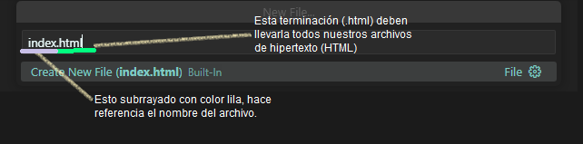

#### ¿Cómo sé si es un archivo HTML?

Existe una estructura básica de HTML.

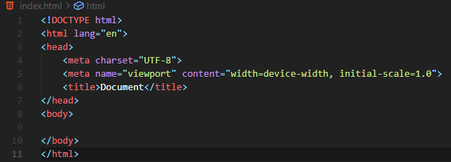

**Lo que se ve en la imagen anterior, es la estructura de HTML5** 

El estándar actual de HTML es el 5, el cuál busca mejorar la semantica (Significado de las palabras) y de las etiquetas con el objetivo de dar mayor contexto a los programadores de como esta organizado el sitio web.

#### Etiquetas principales de HTML5.

* ```<\!DOCTYPE html>```: siempre debe ser el inicio de nuestro documento. Esta etiqueta le dice al navegador que tipo documento es para que el navegador sepa como manejarlo


* ```<html lang="en">```:
la etiqueta html es la que indica donde empieza a construirse el sitio web y el _atributo_ ``lang="en"`` es para especificar en que idioma estará el sitio web; algunos ejemplos son "es" para español "fr" para frances y "en" para inglés.


lang = languaje.
"en" = english. 

* ```<head>```:
dentro de esta etiqueta se colocan elementos que el navegador va a usar, pero no se van a mostrar en el cuerpo de la página. Aquí van elementos como el título de nuestra página, la imagen que aparece en la pestaña del navegador, o las palabras clave para indexar en buscadores.

* ```<title> Escribe el título de tu página web </title>```
muestra el texto introducido entre las etiquetas de apertura y cierre, en la pestaña del navegador

* Meta etiquetas:

La etiqueta meta es por _metadatos_, estos proveeran elementos configurables a nuestro sitio web tales como: que tipo de caracteres vamos a ocupar en nuestro sitio web, como escalar el contenido para dispositivos moviles, datos para ayudar a la busqueda de nuestro sitio web, etc., aquí algunos ejemplos:

**_meta_** = algo que se encuentra dentro de algo (datos de los datos).

*
    * ``` <meta charset="UTF-8">```:
especifica que los caracteres que nuestro sitio web va a acupar son o pueden ser todos estos.
[https://www.fileformat.info/info/charset/UTF-8/list.htm](https://www.fileformat.info/info/charset/UTF-8/list.htm)

    * ```<meta name="viewport" content="width=device-width, initial-scale=1.0">```:
este especifica que va a escalar el contenido de nuestro sitio web segun el ancho del dispositivo en el que se muestre nuestro sitio. A esto lo llamamos viewport.

* ```<body>```:
todos los elementos que se escriban dentro de esta etiqueta se van a mostrar en el website (sitio web). Aquí van las etiquetas de texto, imágenes, botones, inputs, etc.
---
### ¿Cómo puedo hacer para que en mi documento aparezcan todas esas etiquetas?

Este formato de HTML5 ya se encuentra predeterminado en VS Code. 

Bastará tan solo con colocar en la primera línea de nuestro nuevo archivo **_.html_** ya sea...

(!) = signo cierre de exclamación.

o bien colocar...

_html_ y aparecerá un renglón de autocompletado, tal como se observa en la siguiente imagen.

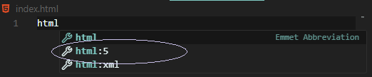

Una vez dado el click en esa opción, aparecerán las etiquetas correspondientes.

---
## ¿Etiquetas contenedoras y de texto? 

**_Una etiqueta CONTENEDORA en HTML es una etiqueta que envuelve y agrupa otros elementos._**

Creando una estructura organizada dentro de un documento web. 

Suele utilizarse para aplicar estilos o manipular el diseño de varios elementos al mismo tiempo. Ejemplos comunes son las siguientes etiquetas que ayudan a estructurar y dar estilo al contenido dentro de ellas.

* ```<div></div>```: esta etiqueta es uno de los elementos más utilizados para la estructura y organización del contenido en una página web. Su función principal es crear contenedores o bloques genéricos en los cuales puedes agrupar elementos HTML.

* ```<header></header>```: muestra el encabezado principal de una sección.

* ```<main></main>```: coloca el contenido más reelevante del sitio; es decir el primer contenido visible al cargar el sitio.

* ```<footer></footer>```: delimita el pie de página o el final de un sitio.

* ```<nav></nav>```: delimita una barra de navegación en tu página web.


**_Una etiqueta de texto en HTML se utiliza para mostrar contenido específico y directamente en una página web._**

Estas etiquetas permiten dar formato y estructura al contenido textual en una página web.

Ejemplo de estas son:

* ```<p></p>```: se utiliza para crear bloques de texto en una página web, delimitar y formatear dichos bloques como párrafos.

* ```<span></span>```: se utiliza para aplicar estilos, con ella puedes resaltar un texto específico. En otras palabras ```<span>``` es como una herramienta versátil para afectar **partes pequeñas de texto o contenido** sin alterar la estructura general de la página.

* ```<h1></h1> hasta <h6></h6>```: se utilizan para crear encabezados de diferentes niveles en una página web.
Estas etiquetas se denominan "encabezados" y se utilizan para estructurar y organizar el contenido de manera jerárquica.


 ---
 ## Etiquetas básicas en HTML.

 En este apartado te proporcionaremos algunas etiquetas de uso común con una explicación breve de su funcionamiento.

 **Toma notas o guarda esta información en donde puedas tenerlo a la mano.**

* ```<div> </div>```: esta etiqueta es uno de los elementos más utilizados para la estructura y organización del contenido en una página web.

La palabra "div" es una abreviatura de "división" (division en inglés), y su función principal es crear contenedores o bloques genéricos en los cuales puedes agrupar elementos HTML para aplicar estilos, controlar el diseño, o para otros fines de estructuración.

APOYO VISUAL.

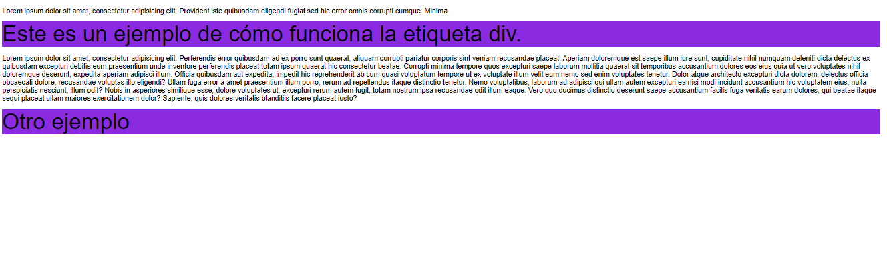

* ```<h1> a <h6>```:  se utilizan para crear encabezados de diferentes niveles en una página web.
Estas etiquetas se denominan "encabezados" y se utilizan para estructurar y organizar el contenido de manera jerárquica.

APOYO VISUAL.

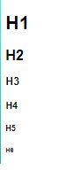

* ```<p> </p>```: se utiliza para crear párrafos de texto en una página web.

La abreviatura "p" significa "párrafo". Esta etiqueta se utiliza para delimitar y formatear bloques de texto como párrafos, lo que hace que el contenido sea más legible y estructurado.

APOYO VISUAL.

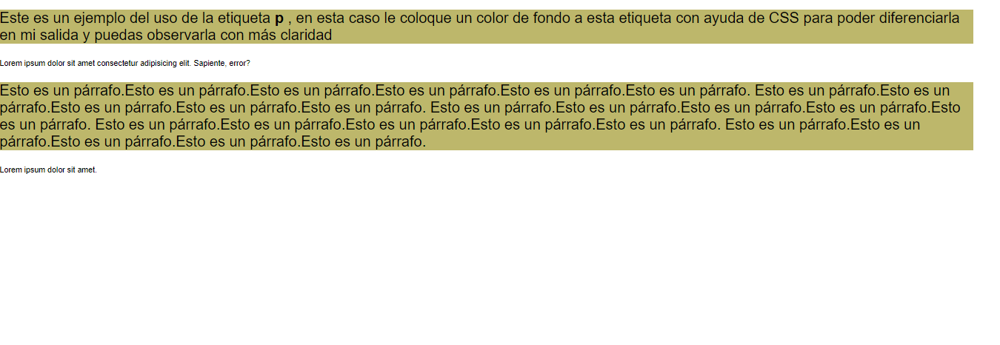


* ```<a> </a>```: usada para poner hipervínculos a una dirección en particular y así al darle click seremos llevados a ese sitio.

Contiene el atributo "href" que contiene la _url_ a dónde seremos redireccionados

```
<a href="https://google.com"> texto </a>
```
En la salida de tu navegador esto se vería de la siguiente forma.

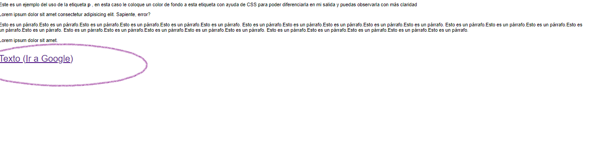

* ``````: Se usa para integrar imágenes a nuestros sitios web.

No tiene etiqueta de cierre y tiene dos atributos especiales **src=" que es la ubicación de la imagen"** y **alt="texto externo en caso de que no cargue correctamente la imagen"**

```

```

En la salida de tu navegador se colocará una imagen.

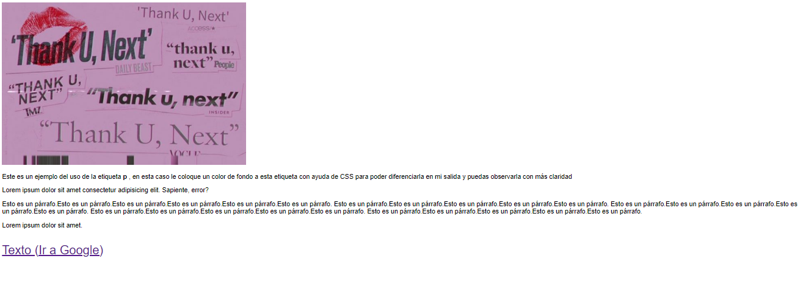
#### Listas

Son estructuras que definen una lista, pueden ser ordenadas (con número) usando la etiqueta ```<ol></ol>```, o desordenadas (sin número) usando la etiqueta ```<ul></ul>```, dentro de estos utilizamos la etiqueta ```<li></li>``` para mostrar los elementos de nuestras listas

 * ```<ol> </ol>```: significa order list (lista ordenada). 
 * ```<ul> </ul>```: significa unorder list (lista desordenada)-
 * ```<li> </li>```: sinifica list item (elemento de lista).

```
<!-- Lista desordenada -->
<ul>
    <li>Elemento de una lista desordenada</li>
    <li>Otro elemento de una lista desordenada</li>
</ul>

<!-- Lista ordenada -->
<ol>
    <li>Elemento de una lista ordenada</li>
    <li>Otro elemento de una lista ordenada</li>
</ol>
```
APOYO VISUAL

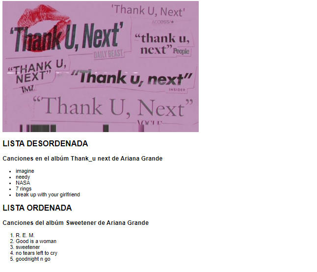

* ```<button> </button>```: se utiliza para crear un botón interactivo en una página web.

Los botones son elementos fundamentales para la interacción del usuario, permitiendo que los visitantes realicen acciones específicas.

```
<h1>Botón de ejemplo</h1>

    <p>Haz clic en el botón para realizar una acción:</p>

    <button id="miBoton">Haz clic aquí</button>
```
APOYO VISUAL.

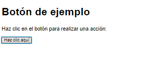

* ```<link>```: se utiliza principalmente para vincular recursos externos a una página web, como hojas de estilo (CSS), fuentes tipográficas y relaciones entre páginas.

Aprenderemos a utilizar esta etiqueta en el siguiente módulo que aborda el tema de CSS.

 APOYO VISUAL.

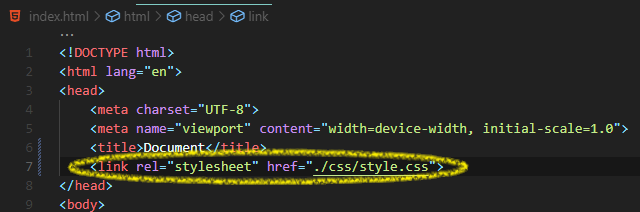

---
