# Introducción a CSS.

**CSS** por sus siglas en Inglés, significa.

**C**ascading

**S**tyle

**S**heets       

CSS es el lenguaje que usamos para diseñar un documento HTML. 
Por lo tanto, CSS describe cómo deben mostrarse los elementos HTML.

HTML es capaz de dar estructura a nuestro sitio, sin embargo no es capaz de dar estilos.
Las **hojas de estilos en cascada (CSS)**, se encargan de establecer las reglas de apariencia de cada elemento de un html (estilos), como tamaños, colores, tipografías, posiciones, entre otros más.

---

## ¿Cómo  crear un archivo CSS?

El proceso de crear un archivo CSS, es similar al de HTML. A diferencia que este no llevará terminación (.html) sino más bien **_.CSS_** en letras minúsculas.

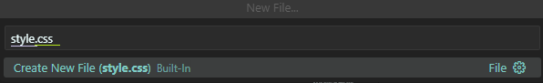

* La palabra subrayada en color **morado**, indica el nombre del archivo, que de la misma forma que en HTML este puede variar.

* La terminación **.css** subrayada en color verde indica que este documento es de tipo CSS. Por consiguiente, todos los archivos por hacer en estilo cascada deberán llevar terminación **.css.**

---

## Carpeta CSS y archivo HTML.

Como ya hemos leído al inicio de este apartado, para que un documento CSS pueda funcionar, necesita estar enlazado a una página web para poder darle un estilo.

Entonces es necesario aprender a enlazar mi archivo HTML con CSS para que trabajen en conjunto.

* Si bien, se debe tener una carpeta específica y única que contenga solamente nuestros archivos HTML y CSS del proyecto que estamos por realizar.

APOYO GRÁFICO.

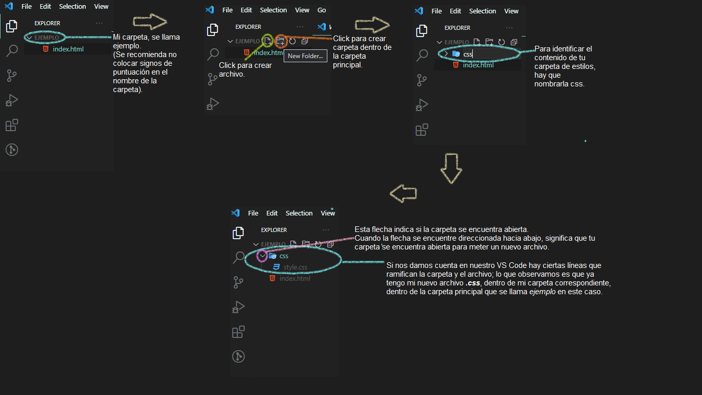

---
## Enlazar mi archivo HTML con CSS.

Los estilos (CSS) se vinculan desde el html con la etiqueta link.

```
<link rel="stylesheet" href="nombredetuarchivo.css">
```
EJEMPLO

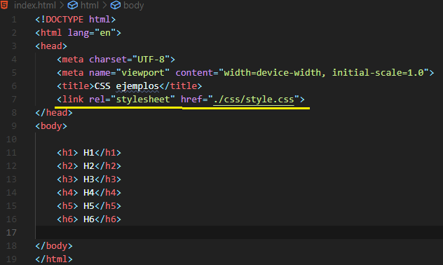

La separación del nombre de la carpeta y el nombre del archivo, se hace con un **(/)** slash o diagonal.

IMPORTANTE!! 
VS Code es muy práctico, ya que con tan sol colocar en el atributo los signos **(./)** aparecerán las carpetas que se tienen y los archivos.

EJEMPLO

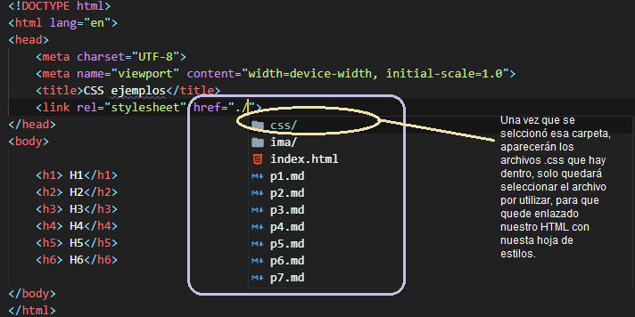

Aunque a pesar de que es muy práctico tener nuestra propia hoja de estilos, también se pueden colocar estos dentro de nuestro mismo archivo HTML utilizando la etiqueta ```<style></style>```, adentro de esta etiqueta deberán estar los estilos especificados, ya sea en forma de _selector de etiqueta, id o clases_.

 P.D. No te asustes en el siguiente apartado se explican a detalle ¿Qué son los selectores? y los tipos de selectores.

APOYO VISUAL.

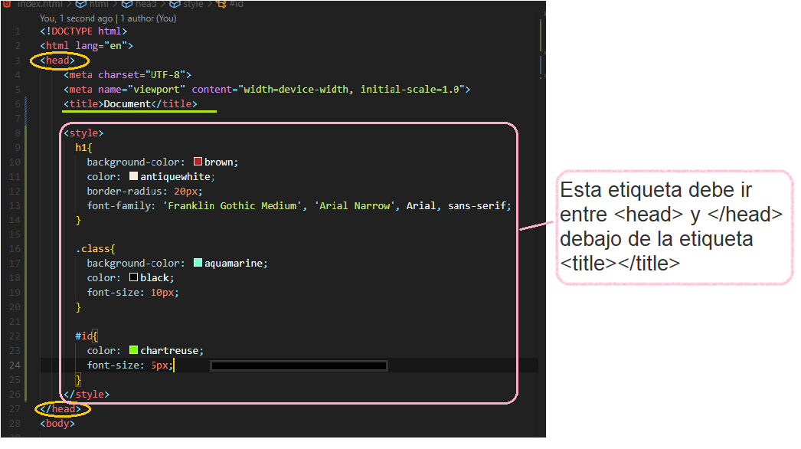
---
## Tipos de Selectores (ID, clase, etiqueta) 
**Selectores**
Indican a qué elemento de html se le van a aplicar los estilos.

**_Selectores de Etiqueta_**

Se refiere a los nombres directos de las etiquetas a las que queremos aplicar los estilos.

P.D. Es importante tener cuidado porque si hay más de una etiqueta con el mismo nombre, se aplicarán los estilos a todas.

```
h1{
    color: purple
}
```

APOYO VISUAL.

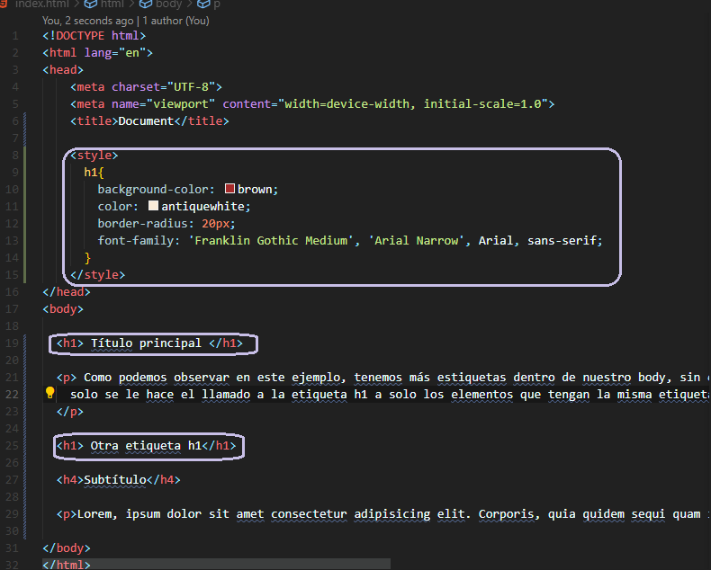

Salida de tu navegaor.

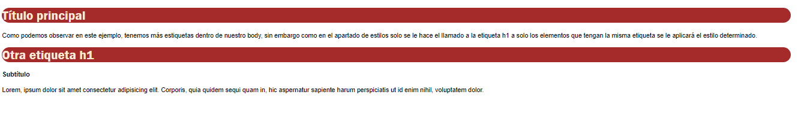

**_Selectores de clases_**

Son selectores con nombres personalizados, estos están precedidos por un punto (.nombre de la clase). 

Sirven para poner estilos a las etiquetas que necesitemos, sin importar cual sea el nombre de la etiqueta; es recomendable que las clases tengan nombres que describen al elemento. 

Las clases se pueden repetir varias veces en el HTML.

```
.clase{
    background-color:blue
}
```
APOYO VISUAL.

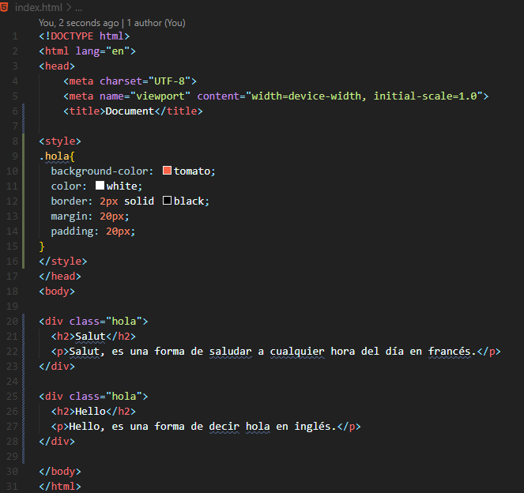

Salida en tu navegador.

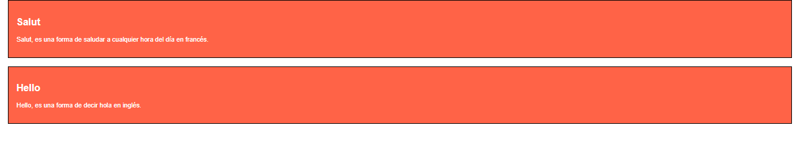


**_Selectores de ID_**

Selectores únicos, solo puede haber uno con el mismo nombre en un documento html. Están precedidas por el símbolo (#).

```
#encabezado{

    font-size:10px
} 
```
APOYO VISUAL.

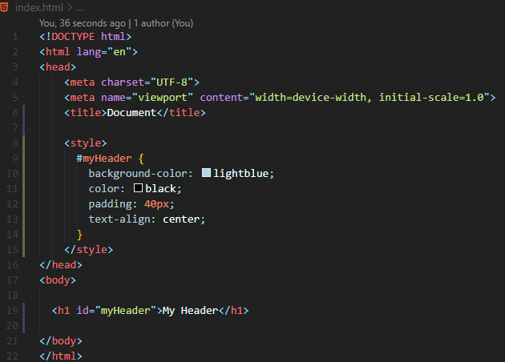

Salida en tu navegador.

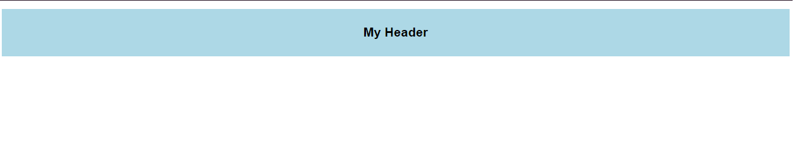

---
## Display.

Es una propiedad de CSS muy común.

Cada elemento de HTML, se comporta como una caja o cuadro, pero _display_ puede darle distintas variaciones, tales como:

* Display:none&nbsp;
* display:block;
* display:inline;
* display:inline-block;

**_Display none_**

Permite ocultar un elemento que será posible verlo en el navegador. Normalmente utilizado para ocultar elementos que no deben verse a menos que una condición, se cumpla.

---
**_Display block (bloque) / Display inline (en línea)._**

Las etiquetas \<div>, \<p>, \<ul> se colocan una sobre de otra, esto es porque contienen la posición block y cada nuevo elemento comienza con una nueva línea. Por otro lado las etiquetas \<span>, \ o \<a> se colocan una después de otra en la misma línea.

1. Ejemplo de elementos en bloque; se colocan uno sobre otro.

```
<div>  <p> Soy un párrafo </p>  <p> También soy un párrafo </p> </div>
```

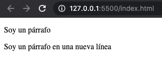

_Características de display block_

* Toman todoel ancho del contenedor.
* Cada uno se muestra en una nueva línea.
* Es posible establecerle propiedades como alto (_height_) y ancho(_width_).


1. Ejemplo de elementos en línea; se colocan un después del otro.

```
<div>  <span> Soy una palabra </span>  <span> También soy una palabra. </span> </div>
```
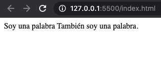

_Características de display inline_

* Utilizan solo el espacio que necesiten.
* Puede ser una etiqueta "padre" de otros elementos en línea.

---

**_Elementos inline-block_**

En algunos casos, ambos valores de visualización pueden no ser suficientes para un mejor diseño web. En ese momento, este tercer comportamiento de presentación se aplica y también hace que la alineación sea mucho más fácil.

```
#elemento {
  display: inline-block;
}
```

Como se puede comprender, este es una mezcla de _block_ e _inline_.

En otras palabras, podemos pensar en un elemento en línea, que las propiedades de ancho y alto se pueden establecer, o podemos pensar en un elemento a nivel de bloque, que no tiene que comenzar con una nueva línea.

---

## Box Model

El box model o "modelo de caja", es similar a una caja que envuelve cada elemento HTML, es decir que, todos los elementos de HTML se consideran cajas.

Este modelo sirve para crear o agrupar secciones con fines estéticos.

Por esto todo navegador renderiza cada elemento de la página, en forma rectangular.

Por lo tanto el Box Model se visualiza de la siguiente forma en el inspector de tu navegador.

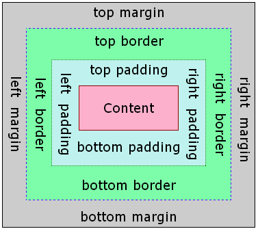

**Partes de Box model.**

* _Content_: Se encuentra el contenido en sí.

* _Padding_: Es el espacio entre el border y el contenido. (Relleno o espacio interior).
* _Border_: La línea del borde.

* _Margin_: Es la distancia que hay desde el borde del elemento, hacia cualquier adyacente. (Margen o espacio exterior).

Ejemplo de como estilizar padding.
```
.clase {
    padding-top: 10px;
    padding-left: 10px;
    padding-right: 10px;
    padding-bottom: 10px;
}
```
Ejemplo de estilización de border.
```
clase {
    border: solid 5px red;
}
```
Ejemplo de estilización de Marging.
```
clase {
    margin-top: 10px;
    margin-left: 10px;
    margin-right: 10px;
    margin-bottom: 10px;
}
```

---

P.D. No te asustes si no conoces algunas propiedades que se muestran en los ejemplos, en la siguiente sección tus dudas serán resueltas! 😎

---
## Organización de las propiedades.

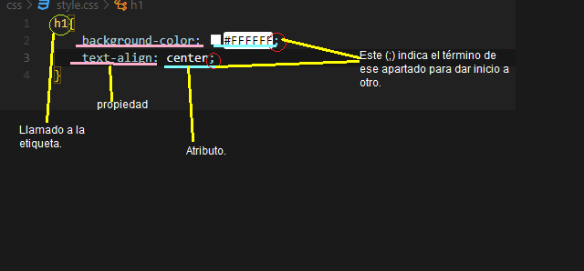
---
## Propiedades de CSS.

Estas propiedades son las más utilizadas en CSS, por lo tanto te recomiendo que tomes nota o guardes este documento a la mano.

##### Propiedades de colores.

> * **color**: Da color al texto.

> * **Background-color**: Cambia de color al texto.

#### ¿Cómo coloco los colores?

Es reelevante saber que HTML utiliza una forma especial
para colocar colores. 

Hexadecimal; El color hexadecimal es un sistema de notación numérica utilizado para representar colores en la mayoría de las páginas web. 

_Estructura de colores hexadecimales._

#fefae0 = Estrucutra de color blanco.

P.D. Recuerda colocar (#) antes de colocar los carácteres siguientes.

**_Aquí te dejo una herramienta que te puede ser útil para una buena combinación de colores._**

> [Coolors.co](https://coolors.co/palettes/trending)

---
##### Propiedades de texto.

> * **font-size**: indica el tamaño de letra o texto en **pixeles (px).**

```
h1{
    font size: 20px;
}
```
> * **font-family**: Indica la fuente o tipo de letra del texto, es decir; que si se quiere que el texto aparezca con la fuente "Arial" habría que colocar lo siguiente.

```
body{
    font-family: arial;
}
```

> * **text-decoration**: Tal y como lo dice en su nombre, da decoración al texto.

Los atributos para este son:
1. line-through;
1. overline;
1. solid;
1. underline;

APOYO VISUAL.

En esta imagen se visualiza un ejemplo de como colocar y en tu HTML estilos CSS de tipo text-decoration.
P.D. Esto está hecho a base de selectores tipo class (clase). 

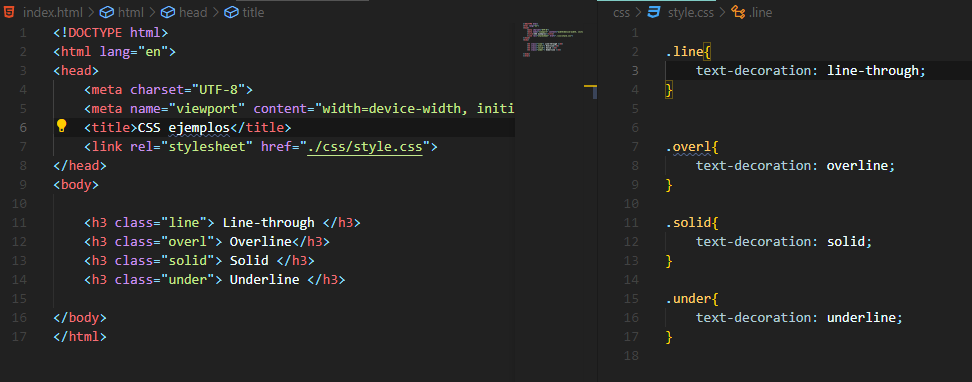

En base al código anterior, así debe verse la salida en tu navegador.

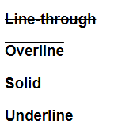

> * **text-align**: Da alineación al texto.

Los atributos para esta propiedad son:
1. center (texto centrado).
1. justify (texto justificado).
1. left (texto alineado a la izquierda).
1. right (texto alineado a la derecha).

```
p{
    text-align: center;
}
```

---
##### Propiedades de imagen.

> * **broder-radius**: Redondea una imagen, según la cantidad de **_pixeles (px)_** que se le indique.

EJEMPLO VISUAL.

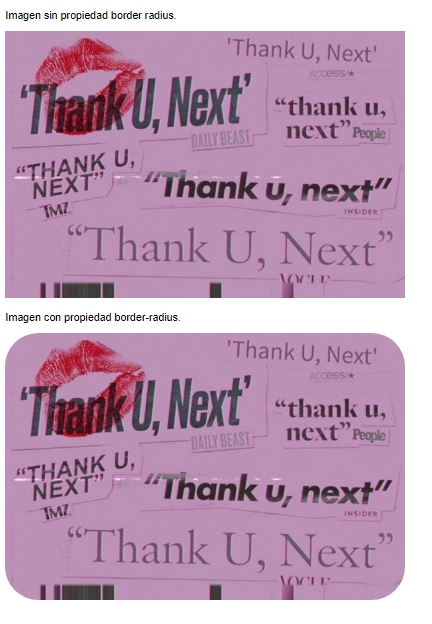

Aquí te dejo el ejemplo del código para poder aplicar esta propiedad.

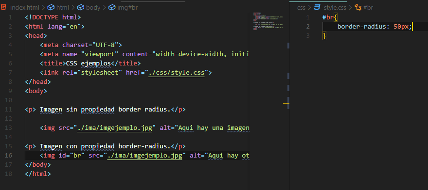


> * **Background-image**: Se coloca una imagen de fondo en ese apartado.
---